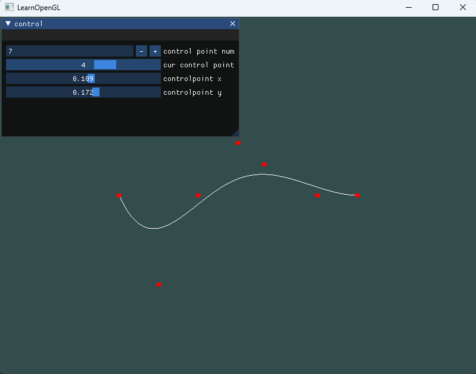
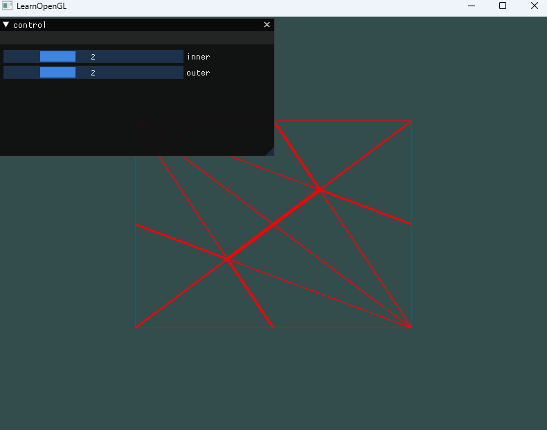
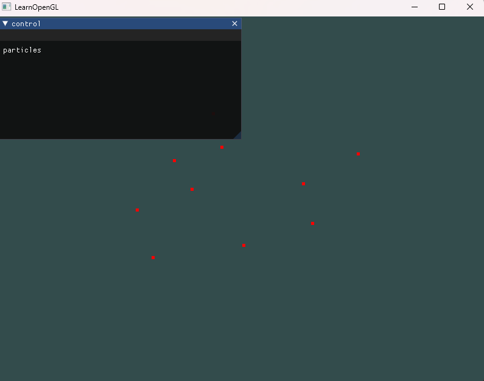
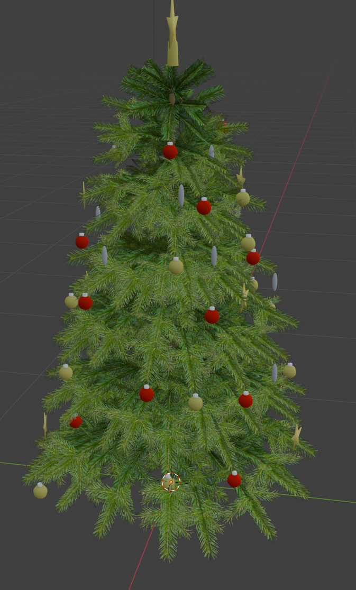
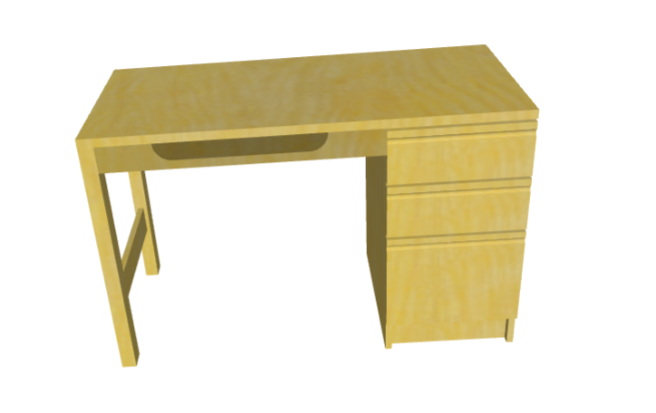

# SJTU SE CG Course

[a repo for tutorial](https://github.com/scarletfantasy/sjtu-se-cg)

# demos

## demo

basic homework architecture with minimum code

## bezier curve

a program of simple bezier curve implement

## tessellation

a program of simple tesselation example

## particles

a program of simple cs particles

## Simple Scene

简单的 `OpenGL` 场景，用于对 `OpenGL` 框架的初步了解

## objLoader

简单的`.obj .mtl`模型导入，仅供参考

# model

## obj

简单的`.obj`类型模型文件，可用作实验模型

### 带材质的obj模型

带有`.mtl`文件提供的材质信息

#### 圣诞树模型

#### 桌子模型

# request
* imgui
* glfw
* glad
* assimp(optional)
* eigen(optional)

# install using vcpkg
安装和使用说明详见 [microsoft vcpkg](https://github.com/microsoft/vcpkg)

    vcpkg integrate install
    vcpkg install glfw3:x64-windows glad:x64-windows imgui[core,opengl3-binding,glfw-binding]:x64-windows
    vcpkg install assimp:x64-windows eigen3:x64-windows
