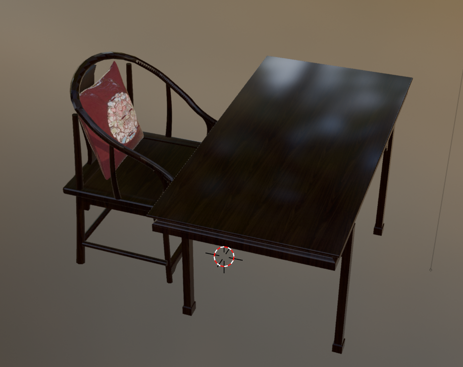

# SJTU SE CG Course

[a repo for tutorial](https://github.com/scarletfantasy/sjtu-se-cg)

# demos

## demo

basic homework architecture with minimum code

## bezier curve

a program of simple bezier curve implement

## tessellation

a program of simple tesselation example

## particles

a program of simple cs particles

## Simple Scene

简单的 `OpenGL` 场景，用于对 `OpenGL` 框架的初步了解

## objLoader

### 简单的`.obj .mtl`模型导入，仅供参考!仅供参考!仅供参考!

一个十分简单的用于示范如何导入同时带有纹理图片与不含纹理图片的demo，仅能导入christmas_tree.obj(如想导入其它`.obj .mtl`模型，请自行编写/更改shader, model.h, mesh.h)

注释编写/删除得不够完整，不用太在意注释

如有疑问请自行参考以下网址：

Assimp库调用mtl加载obj模型: https://blog.csdn.net/weixin_39015733/article/details/123553297

使用Assimp库读取mtl文件数据: https://blog.csdn.net/manipu1a/article/details/85340045

如何使用assimp读取obj文件的材质: https://zhuanlan.zhihu.com/p/489803630

OBJ模型文件与MTL材质文件介绍: https://blog.csdn.net/newchenxf/article/details/121394626

# model

## obj

简单的`.obj`类型模型文件，可用作实验模型

### 带材质的obj模型

带有`.mtl`文件提供的材质信息

#### 圣诞树模型

#### 桌子模型

#### 中式书桌模型

# request
* imgui
* glfw
* glad
* assimp(optional)
* eigen(optional)

# install using vcpkg
安装和使用说明详见 [microsoft vcpkg](https://github.com/microsoft/vcpkg)

    vcpkg integrate install
    vcpkg install glfw3:x64-windows glad:x64-windows imgui[core,opengl3-binding,glfw-binding]:x64-windows
    vcpkg install assimp:x64-windows eigen3:x64-windows
