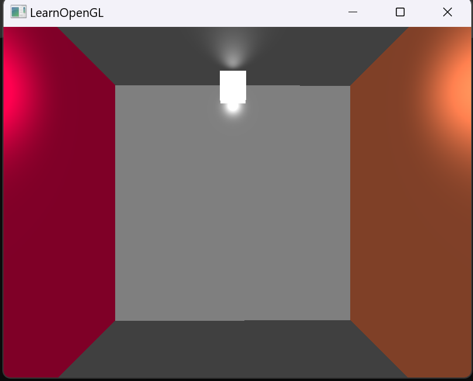

# 1. CG环境配置

## 安装 Visual Studio 2022

这里教程比较多，就不一一列出了

## 按照 OpenGL 官网上的方式一步一步配置环境

[opengl中文官网](https://learnopengl-cn.github.io/)

## 测试是否配置成功

这里有一些（~~流传下来的~~）代码，测试一下环境配置吧

[上一届助教的恩泽](https://github.com/scarletfantasy/sjtu-se-cg/tree/main/demo)

# 2. 如果能够成功运行，请跳过此节

## 安装 vcpkg

[vcpkg安装](https://github.com/microsoft/vcpkg?tab=readme-ov-file)

这里和<b>本文档所有</b>内容以 Windows 为例（非 Windows 用户请自行解决）：

[在 Windows 上安装 vcpkg ](https://learn.microsoft.com/zh-cn/vcpkg/get_started/get-started-vs?pivots=shell-cmd)

### 克隆存储库

第一步是从 GitHub 克隆 vcpkg 存储库。 存储库包含用于获取 vcpkg 可执行文件的脚本，以及由 vcpkg 社区维护的特选开放源代码库的注册表。 若要执行此操作，请运行：

```
git clone https://github.com/microsoft/vcpkg.git
```
vcpkg 特选注册表是一组数量超过 2000 个的开源库。 这些库已通过 vcpkg 的持续集成管道进行验证，可以协同工作。 虽然 vcpkg 存储库不包含这些库的源代码，但它保存方案和元数据，以便在系统中生成和安装它们。

### 运行启动脚本

现在，你已经克隆了 vcpkg 存储库，请导航到 vcpkg 目录并执行启动脚本：

```
cd vcpkg && bootstrap-vcpkg.bat
```

启动脚本执行先决条件检查并下载 vcpkg 可执行文件。

就这么简单！ vcpkg 已安装并可供使用。

### 将vcpkg添加到环境变量（可选）

编辑 Windows 的系统环境变量

在系统变量中添加变量名：`VCPKG_ROOT`，变量值：`你安装vcpkg的路径/vcpkg`，并在变量名为 `Path` 的变量值中添加 `%VCPKG_ROOT%`

按住`win + R`后，输入`cmd`进入命令提示符界面，输入 `vcpkg` 后输出如下：

```cmd
usage: vcpkg <command> [--switches] [--options=values] [arguments] @response_file
  @response_file         Contains one argument per line expanded at that location

Package Installation:
  export                 Creates a standalone deployment of installed ports
  ......
  ......

For more help (including examples) see https://learn.microsoft.com/vcpkg
```
则配置成功

这样就不用在vcpkg的安装目录进行操作了

## 使用 vcpkg 配置开发环境

打开命令行并输入（如未配置环境变量则需在vcpkg的安装目录打开命令行）：

```powershell
vcpkg integrate install
vcpkg install glfw3:x64-windows glad:x64-windows imgui[core,opengl3-binding,glfw-binding]:x64-windows
vcpkg install assimp:x64-windows eigen3:x64-windows
```

如果在安装过程中出现长时间卡顿或者出现类似于如下的情况：
```
......
vcpkg：Could not find PowerShell Core（Building package libwebp:x64-windows failed ）
```

则进行下一步：安装 PowerShell，否则跳过

<details>

  <summary>安装 PowerShell（not Windows PowerShell）（注意跳过条件）</summary>


  [在 Windows 上安装 PowerShell](https://learn.microsoft.com/zh-cn/powershell/scripting/install/installing-powershell-on-windows?view=powershell-7.4#winget)

  通过以下命令，可使用已发布的 `winget` 包安装 PowerShell：（推荐）

  搜索最新版本的 PowerShell
  ```powershell
  winget search Microsoft.PowerShell
  ```
  输出如下：
  ```powershell
  Name               Id                           Version   Source
  -----------------------------------------------------------------
  PowerShell         Microsoft.PowerShell         7.4.5.0   winget
  PowerShell Preview Microsoft.PowerShell.Preview 7.5.0.3   winget
  ```
  使用 `id` 参数安装 PowerShell 或 PowerShell 预览版
  ```powershell
  winget install --id Microsoft.Powershell --source winget
  winget install --id Microsoft.Powershell.Preview --source winget
  ```

  安装成功后，在开始栏搜索`powershell`，你会看到`PowerShell 7 (x64)`，打开后会看到如下输出：
  ```powershell
  PowerShell 7.4.5
  PS C:\Users\username>
  ```

  #### 注意不是`Windows PowerShell`!!!

  在此 PowerShell 里继续执行之前的操作吧：
  ```powershell
  vcpkg integrate install
  vcpkg install glfw3:x64-windows glad:x64-windows imgui[core,opengl3-binding,glfw-binding]:x64-windows
  vcpkg install assimp:x64-windows eigen3:x64-windows
  ```

  若没有任何报错即安装成功
</details>

### 通过 vcpkg 配置环境时无需对 Visual Studio 2022 进行额外操作

# 3. 效果展示



# 4. 注意事项

1. 使用 visual studio 2022 打开项目的方式为`.sln`文件

2. 统一使用`x64`的方式进行调试

3. 修改代码后调试不通过的话，不妨试一试删除项目文件夹里的`x64`文件夹再重新进行调试

4. 项目中的`.h` `.cpp` `.vs` `.fs`文件（不包含`glad.c`等）与环境配置无关，成功配置环境后，可以将代码复制在已成功配置环境的项目中

5. 一切以`Canvas`上的要求为准
